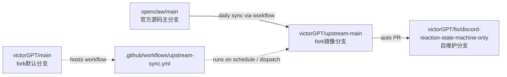

# OpenClaw Fork 上游同步方案（长期维护版）

这份文档描述我们在 `victorGPT/openclaw` 上落地的一套**可长期运行**的上游同步方案：

- 每天自动拉取官方源码主分支最新提交
- 自定义功能与上游变更解耦
- 所有升级通过 PR 审核与 CI，不做黑盒覆盖

---

## 1) 分支角色定义（主分支 / 源码主分支 / 自维护分支）

### 源码主分支（官方）
- `openclaw/main`
- 角色：上游真源（source of truth）
- 约束：我们不直接改，只同步引用

### Fork 主分支（我们的默认分支）
- `victorGPT/main`
- 角色：fork 默认分支 + 承载 workflow
- 约束：不再承担“纯镜像上游”职责

### 镜像分支（我们在 fork 内维护）
- `victorGPT/upstream-main`
- 角色：专门镜像 `openclaw/main`
- 约束：只允许 fast-forward 同步，不放自定义业务改动

### 自维护分支（我们运行的功能分支）
- `victorGPT/fix/discord-reaction-state-machine-only`
- 角色：承载我们自己的 patch（例如 Discord reaction 状态机）
- 约束：通过 PR 接收上游更新，避免直接污染

### 分支流向图（Mermaid）

说明：
- workflow 文件放在 `victorGPT/main`，用于调度。
- 真正承接上游同步的是 `victorGPT/upstream-main`。
- 我们的运行分支只从 `upstream-main` 走 PR 合并，不直接追 `openclaw/main`。

---

## 2) 我们遇到的情况与问题

在方案落地前，我们遇到过几类典型问题：

1. **把 fork/main 直接当上游镜像会迟早冲突**
   - 原因：`main` 本身会承载 workflow 或管理提交。
   - 结果：`git merge --ff-only upstream/main` 不再稳定可用。

2. **workflow_dispatch 一度无法触发（422）**
   - 现象：GitHub 报 `Workflow does not have 'workflow_dispatch' trigger`。
   - 根因：workflow 文件曾有 YAML / run block 写法问题，导致触发器识别异常。

3. **自动 PR 正文格式错误**
   - 现象：PR 正文出现字面量 `\n`，阅读差。
   - 根因：shell 字符串写法导致未按预期换行。

结论：我们需要把“镜像职责”“业务职责”“调度职责”拆开，而不是塞在一个分支里硬跑。

---

## 3) 最终解决思路与落地方案

核心原则：**职责分离 + 自动化 + 审核门禁**。

### 3.1 职责分离
- `victorGPT/main`：放 workflow（调度入口）
- `victorGPT/upstream-main`：放上游镜像（只 ff）
- `fix/discord-reaction-state-machine-only`：放自定义 patch

### 3.2 自动化同步流程（GitHub Actions）
工作流文件：`.github/workflows/upstream-sync.yml`

触发方式：
- `schedule`: 每天 UTC 02:17（东京 11:17）
- `workflow_dispatch`: 手动触发

执行逻辑：
1. 拉取 `openclaw/main`
2. 同步 `victorGPT/upstream-main`（`--ff-only`）
3. 若无变化：退出（安静跳过）
4. 若有变化：
   - push 新的 `upstream-main`
   - 自动创建或更新 PR：
     - `upstream-main -> fix/discord-reaction-state-machine-only`

### 3.3 门禁策略（推荐强制）
- 对 `fix/discord-reaction-state-machine-only` 开启 branch protection：
  - 禁止直推
  - 必须 CI 通过
  - 至少 1 个 review
- 避免把自定义提交直接打到 `upstream-main`

---

## 4) 为什么这套方案是“长期可维护”的

- **可追溯**：每次上游更新都是 PR 记录
- **可回滚**：问题版本可按 PR 颗粒回退
- **低冲突**：镜像与业务改动分层，冲突面更小
- **团队协作友好**：分支职责清楚，新同学能快速理解

---

## 5) 日常运维手册（简版）

### 日常（自动）
- 等待每日 workflow 触发
- 若上游有更新，会自动出现升级 PR
- 评审 + CI 通过后合并到自维护分支

### 手动（应急）
- 在 GitHub Actions 手动触发 `Upstream Sync`
- 检查是否创建/更新 PR

### 排障要点
- 看 workflow run 日志中是否出现：
  - `Already up to date.`（正常，表示当日无新变化）
  - 触发器/权限异常（通常是 YAML 或权限配置问题）

---

## 6) 方案总结（给管理层/新成员）

一句话总结：

> 我们不再用 fork 的 `main` 直接追上游，而是引入专门镜像分支 `upstream-main`；
> 再通过自动 PR 把上游变更引入自维护分支，实现“持续同步 + 不覆盖定制 + 可审计回滚”的长期维护能力。
